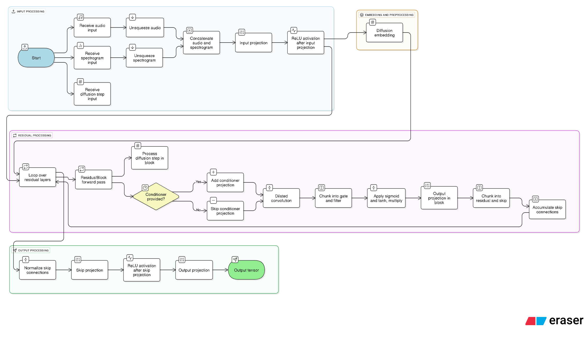

# Yapay Zeka Tabanlı Ses Sistemlerinde Gürültü Engelleme
### DOSE (Denoising Output from Stochastic Embedding) Modeli Kullanılarak


## 📋 Proje Hakkında

Bu proje, derin öğrenme ve difüzyon modelleri kullanarak ses kayıtlarından gürültü temizleme işlemi gerçekleştiren ileri düzey bir ses işleme sistemidir. DOSE (Denoising Output from Stochastic Embedding) modeli kullanılarak, gürültülü ses kayıtları temizlenerek daha kaliteli ses çıktıları elde edilmektedir.

### 🎯 Proje Amacı
- Ses kayıtlarındaki gürültü ve yankı problemlerini AI ile çözme
- Düşük kaliteli ses kayıtlarını iyileştirme
- Konuşma netliğini artırma

## 🏗️ Model Mimarisi

### DOSE Modeli Özellikleri
- **Diffusion-based denoising**: Stokastik gürültü giderme
- **Residual Neural Network**: 30 katmanlı residual bloklar
- **EMA (Exponential Moving Average)**: Model ağırlık stabilizasyonu

### Model Parametreleri
```python
- Residual Layers: 30
- Residual Channels: 64
- Dilation Cycle Length: 10
- Sample Rate: 16 kHz
- Batch Size: 16
- Learning Rate: 2e-4
- Dropout Rate: 0.5
```

## 🚀 Özellikler

### ✨ Ana Özellikler
- **Multi-metric evaluation** (PESQ, STOI, CSIG, CBAK, COVL)

- **Docker containerization**
- **Wandb experiment tracking**

### 📊 Değerlendirme Metrikleri
- **PESQ**: Perceptual Evaluation of Speech Quality
- **STOI**: Short-Time Objective Intelligibility
- **CSIG**: Signal distortion
- **CBAK**: Background noise distortion
- **COVL**: Overall quality
- **SSNR**: Segmental SNR

## 📁 Proje Yapısı

```
📦 Yapay-Zeka-Tabanli-Ses-Sistemlerinde-Gurlultu-Engelleme
├── 📂 DOSE_model/                  # Ana model dosyaları
│   ├── learner.py                  # Model eğitim sınıfı
│   ├── model.py                    # DOSE model mimarisi
│   ├── dataset.py                  # Veri yükleme ve işleme
│   ├── params.py                   # Model parametreleri
│   ├── metric.py                   # Değerlendirme metrikleri
│   ├── inference.py                # Model tahmin işlemleri
│   └── wandb_logger.py             # Experiment tracking
├── 📂 gradio/                      # Web arayüzü
│   └── main.py                     # Gradio uygulaması
├── 📂 kod/                         # Yardımcı kod dosyaları
│   ├── P56_method_1.py             # P.56 standardı analizi
│   ├── LKFS_method-1.py            # LKFS loudness analizi
│   └── audio_utils.py              # Ses işleme utilities
├── 📂 notebooks/                   # Jupyter notebook'lar
│   ├── Dose_Train.ipynb            # Model eğitimi
│   ├── Dose_Evaluation.ipynb       # Model değerlendirme
|   ├── veri_on_isleme.ipynb        # Veri ön işleme
│   └── veri_seti_birlestirme.ipynb # Veri seti birlesitrme
├── 📂 docker/                # Containerization
│   ├── Dockerfile
│   └── docker-compose.yml
├── 📂 docs/                  # Dokümantasyon
└── 📂 Veri seti ornekleri/   # Örnek veri setleri
```

## 🛠️ Kurulum

### Sistem Gereksinimleri
- **Python 3.8+**
- **CUDA 11.0+** (GPU kullanımı için)
- **16GB+ RAM** (önerilen)
- **NVIDIA GPU** (önerilen)

### 1. Repository'yi İndirin
```bash
git clone https://github.com/mertsahinnn/Yapay-Zeka-Tabanli-Ses-Sistemlerinde-Gurlultu-Engelleme.git
cd Yapay-Zeka-Tabanli-Ses-Sistemlerinde-Gurlultu-Engelleme
```

### 2. Sanal Ortam Oluşturun
```bash
python -m venv venv
# Windows
venv\Scripts\activate
# Linux/Mac
source venv/bin/activate
```

### 3. Bağımlılıkları Yükleyin
```bash
pip install -r requirements.txt
```

### 4. PESQ Kütüphanesini Yükleyin
```bash
pip install https://github.com/ludlows/python-pesq/archive/refs/heads/dev.zip
```

## 🐳 Docker Kullanımı

### Docker ile Çalıştırma
```bash
# Docker imajını oluşturun
docker build -t dose-denoising ./docker/

# Konteynırı çalıştırın
docker run --gpus all -p 8888:8888 -p 7860:7860 -v $(pwd):/workspace dose-denoising
```

### Docker Compose ile
```bash
docker-compose -f docker/docker-compose.yml up
```

## 🎮 Kullanım

### 1. Model Eğitimi
```bash
cd DOSE_model
python -m learner \
  --train_noisy_speech_dir /path/to/noisy/speech \
  --train_clean_speech_dir /path/to/clean/speech \
  --model_dir ./weights \
  --max_epochs 50
```

### 2. Model Inference
```bash
cd DOSE_model
python inference.py
    /path/to/model_weight
    /path/to/condition(noisy_speech)
    /path/to/output
```

### 3. Web Arayüzü
```bash
cd gradio
python main.py
```
Tarayıcınızda `http://localhost:7860` adresini açın.

### 4. Metrik Değerlendirme
```bash
cd DOSE_model
python metric.py /path/to/clean/speech /path/to/enhanced/speech
```

## 📊 Model Performansı

### Örnek Sonuçlar
| Metrik | Değer |
|--------|-------|
| PESQ   | 2.2   |
| STOI   | 0.79  |
| CSIG   | 3.0   |
| CBAK   | 2.6   |
| COVL   | 2.5   |
| SSNR   | 4.7   |

### Eğitim Grafikleri
Model eğitimi sırasında Weights & Biases kullanılarak metrikler takip edilmektedir.

## 🔧 Konfigürasyon

### Model Parametrelerini Özelleştirme
[`DOSE_model/params.py`](DOSE_model/params.py) dosyasında model parametrelerini düzenleyebilirsiniz:

```python
params = AttrDict(
    batch_size=16,           # Batch boyutu
    learning_rate=2e-4,      # Öğrenme oranı
    residual_layers=30,      # Residual katman sayısı
    residual_channels=64,    # Kanal sayısı
    dropout_rate=0.5,        # Dropout oranı
    use_ema=True,           # EMA kullanımı
    ema_decay=0.99,         # EMA decay oranı
)
```


## 📚 Veri Setleri

### Desteklenen Formatlar
- **WAV** (16 kHz, mono)
- **MP3** (otomatik dönüştürme)

### Veri Hazırlama
```bash
# Veri ön işleme
jupyter notebook notebooks/veri_on_isleme.ipynb

# Veri seti birleştirme
jupyter notebook notebooks/veri_seti_birlestirme.ipynb
```

## 🔬 Araştırma ve Yayınlar

### İlgili Makaleler
- [DOSE: Diffusion Dropout with Adaptive Prior for Speech Enhancement](docs/makale/Genel%20Konu%20Arastirma/NeurIPS-2023-dose-diffusion-dropout-with-adaptive-prior-for-speech-enhancement-Paper-Conference.pdf)
- [Denoising Diffusion Probabilistic Models](docs/makale/Genel%20Konu%20Arastirma/NeurIPS-2020-denoising-diffusion-probabilistic-models-Paper.pdf)
- [AI-Driven Signal Processing: Improving Communication Systems with Machine Learning-Based Noise Reduction](docs/makale/Genel%20Konu%20Arastirma/AI-Driven_Signal_Processing_Improving_Communication_Systems_with_Machine_Learning-Based_Noise_Reduction.pdf)
[EARS: An Anechoic Fullband Speech Dataset Benchmarked for Speech Enhancement and Dereverberation](docs/makale/Veri_Seti_Birlestirme/EARS%20An%20Anechoic%20Fullband%20Speech%20Dataset%20Benchmarked%20for.pdf)


## 📚 Ek Kaynaklar

### Veri Seti
📁 **[Google Drive Veri Seti](https://drive.google.com/drive/folders/149Ztshe9AzQiKuc4tEz5cqvACYu-gQBI?usp=sharing)**


### Model Diagram
<div align="center">
  
</div>
